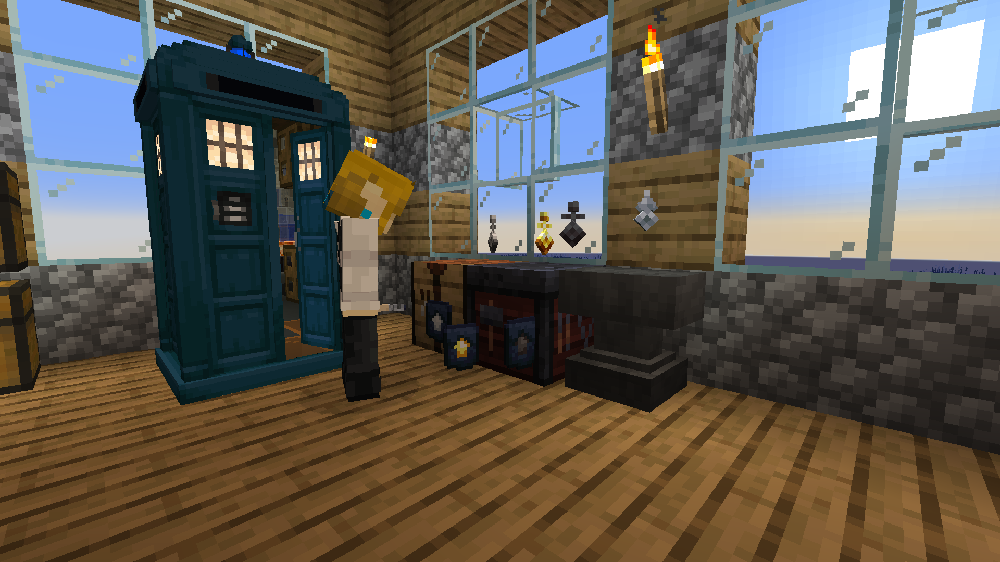

## What keys are there?

* Iron
* Gold
* Netherite
* Classic

## What do they do?

Everything after iron unlocks snapping if you have enough loyalty for it. Each rank of key increases the snapping range aside from iron, which doesn't give the ability to snap.

## How do I get the keys?

* Iron key

* Gold key 

* Netherite key

* Classic key

## How do I get those awesome key trims?

* Iron trim

* Gold trim

* Netherite trim

